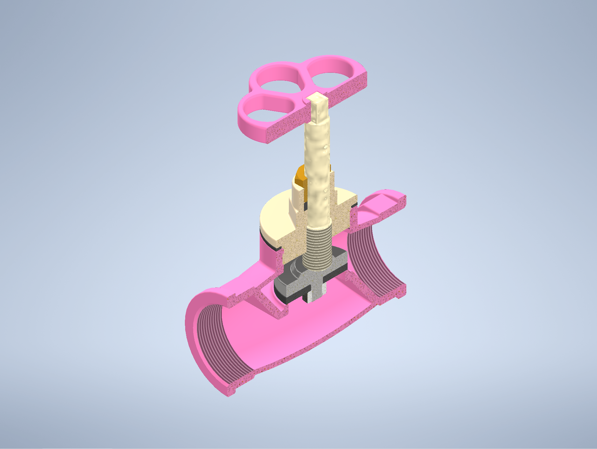
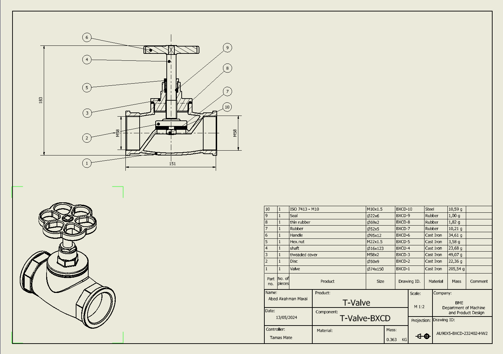

# Reverse Engineering and CAD Modeling of a Mechanical Valve

## 3D View

## Overview
This project involved reverse engineering a physical valve and recreating it as a complete CAD model.

The physical component was measured using precision measurement tools, and a full 3D model and technical drawings were developed using Autodesk Inventor.

## Objectives
- Measure the geometry of a real mechanical component
- Reconstruct the part and assembly in CAD
- Create accurate technical drawings
- Apply proper dimensions and tolerances

## Engineering Approach
The workflow included:

1. Measurement of the physical valve geometry
2. Identification of individual components
3. Parametric modeling of each part in Autodesk Inventor
4. Assembly creation
5. Generation of technical drawings

The model was built to match the physical component dimensions as accurately as possible.

## Tools
- Autodesk Inventor
- Precision measurement tools
- Engineering drawing standards

## Repository Structure

cad  
- Autodesk Inventor models

drawings  
- technical drawings and dimensions

figures  
- CAD renders and assembly views

report  
- project documentation

##  Model

### Valve Assembly

## Key Skills Demonstrated
- reverse engineering
- CAD modeling
- technical drawing
- mechanical assembly design

## Author
Marai Abed Alrahman  
Mechanical Engineering – Budapest University of Technology and Economics
